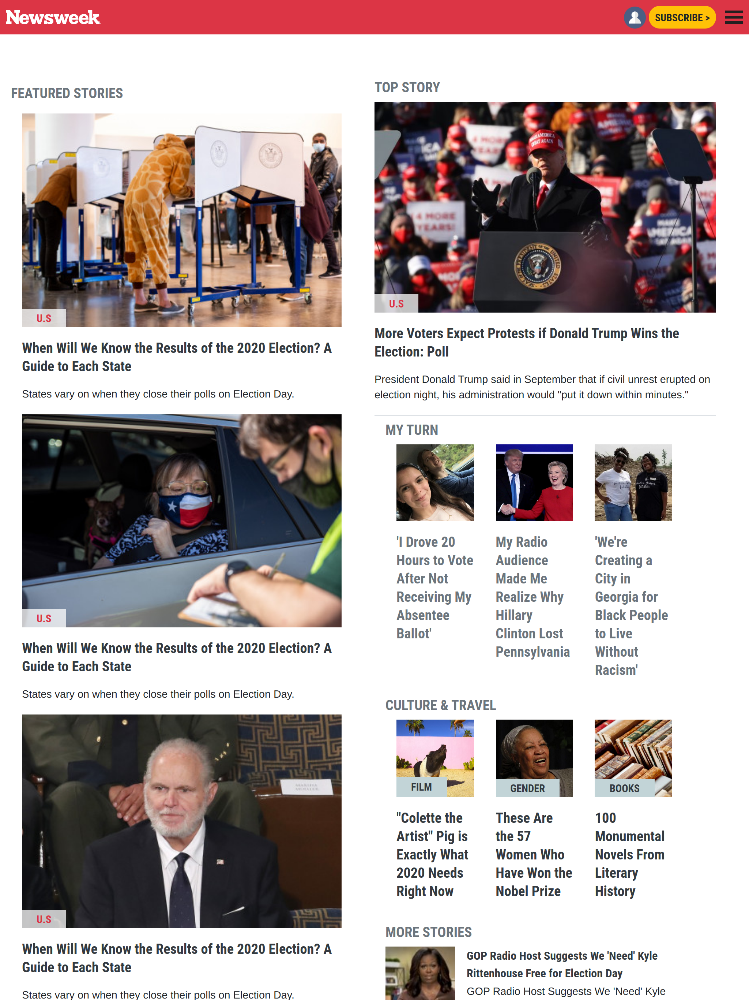

# News-Week Clone Using Bootstrap 

> Creating a responsive clone of News Week (https://www.newsweek.com/). The project includes diferent screen styling for mobile, tablet and desktop dispositives usign the framework bootstrap and a bit of CSS. 

## Desktop UI

## Tablet UI

## Phone UI

## Built With

- HTML
- CSS
- BOOTSTRAP

## Live Demo

[Live Demo Link](https://helman101.github.io/Newsweek-clone/index.html)

## Authors

👤 **Helman Ortegon**

- GitHub: [@helman101](https://github.com/helman101)
- LinkedIn: [LinkedIn](https://www.linkedin.com/in/helman-andres-5187271b1/)

👤 **Elisha Kyakopo**

- GitHub: [@elisha2kyakopo1](https://github.com/elisha2kyakopo1)
- Twitter: [@elisha1k](https://twitter.com/elisha1k)

## 🤝 Contributing

Contributions, issues, and feature requests are welcome!

- Forking the project
- Cloning the project to your local machine
- cd into the project directory
- Run git checkout -b your-branch-name
- Make your contributions
- Push your branch up to your forked repository
- Open a Pull Request with a detailed description to the development branch of the original project for a review

## Show your support

Give a ⭐️ if you like this project!

## Acknowledgments

- Hat tip to anyone whose code was used
- Inspiration
- etc

## 📝 License

This project is [MIT](lic.url) licensed.